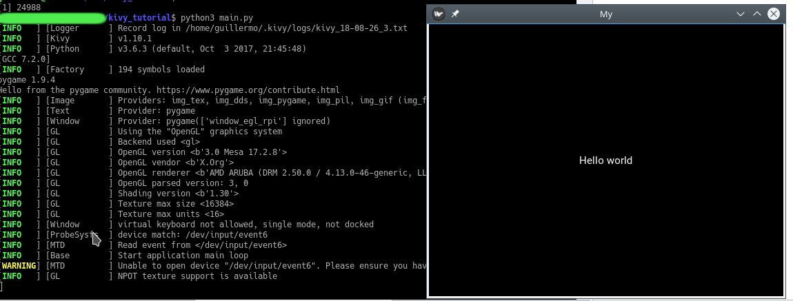

# 1 - Introduction

Install cython, gamepy and kivy via pip. 

If you have a system with a default python of version 2 (check what `python --version` says), you should install python3 and python3-pip before and use pip3 and python3 commands instead of pip and python.

This helloworld example has been taken from kivy basic guide: https://kivy.org/doc/stable/guide/basic.html

Run with:

```
python3 main.py
```

It should show something like this:


